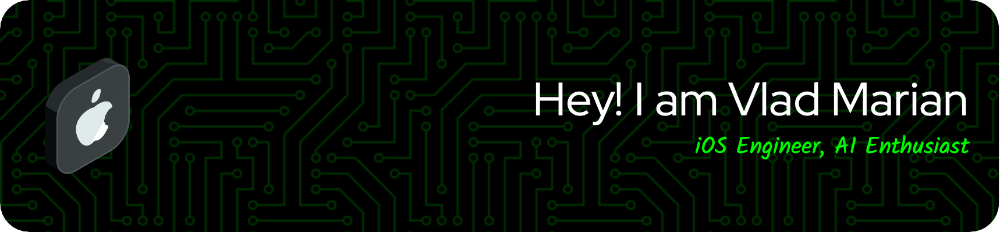

# 👋 Hi, I'm Vlad Marian!

## 👨‍💻 About Me
- 💡 Passionate about **AI, iOS Development**, and building **innovative solutions** that improve everyday life.
- 🌍 Based in **Oradea, Romania**.
- 💼 Currently working on **AI-powered apps**, including a tool to rewrite text in different tones using AI that runs **locally on devices**.
- 🛠️ My tech stack includes **Swift**, **Python**, **C++**, **Java**, and frameworks like **TensorFlow** and **PyTorch**.
- 🎯 My goal is to create **groundbreaking technologies** that **reshape the future**.
- 🎉 Fun fact: I love **watching Formula 1** and **playing tennis and basketball**.

---

## 🌟 Featured Projects
Here are some of my most exciting projects:

### 🏋️ **[FormFusion](https://apps.apple.com/us/app/personal-trainer-ai/id6445799141)**
An AI-driven fitness coach app that provides **real-time feedback** on your exercise form. 
- 🎥 Powered by **computer vision** for precise movement analysis.
- 🤖 Uses **Core ML** and **advanced AI models** for accuracy.
- 🎯 Helps users improve their workout technique.
- ⭐ **4.8/5 Average Rating** from **800+ reviews** on the App Store.

---

### 📱 **[ScanSphere](https://apps.apple.com/us/app/scansphere-scan-pdf-3d-room/id6535089764)**
A versatile iOS app that transforms your iPhone into an all-in-one scanner. 
- 📄 Scan documents to PDF.
- 📏 Create 3D scans of rooms and objects using the **LiDAR sensor**.
- 🛠️ Built with **Swift**, leveraging **Core ML** and **RealityKit**.
- ⭐ **4.8/5 Average Rating** from **600+ reviews** on the App Store.

---

### 🏠 **[Roomify](https://apps.apple.com/us/app/3d-room-scanner-modeling-ai/id1644692405)**
A simple, yet powerful app for **3D room scanning**.
- 📐 View and measure individual wall dimensions with ease.
- 🌟 Leverages the **iPhone camera** and **LiDAR** for unparalleled accuracy.
- ⭐ **4.6/5 Average Rating** from **400+ reviews** on the App Store.

---

### 💪 **[iHustle](https://apps.apple.com/ro/app/ihustle-gym-personal-trainer/id6642709089)**
A personalized fitness training app designed for users of all fitness levels.
- 🏋️ Offers customized workout plans.
- 📊 Tracks progress and adapts routines in real-time.
- 🚀 Built with **Swift**.

---

## 🛠️ Tech Stack

---

## 📈 GitHub Stats

---

## ✨ Fun Projects & Current Goals
- 🔬 Experimenting with **AI agents** and **prompt engineering** using models like **TinyLLaMA**.
- 🤖 Building a **local AI-powered tool** to rewrite text in various tones.
- 🧠 Continuing to explore **reinforcement learning** and **computer vision**.

---

🌟 *"Building the future, one line of code at a time."* 🌟
